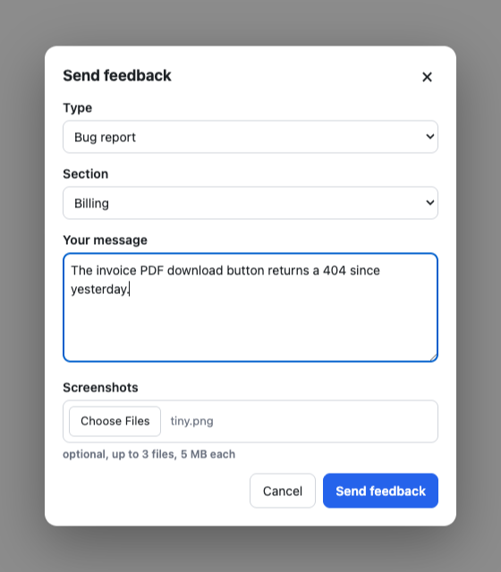
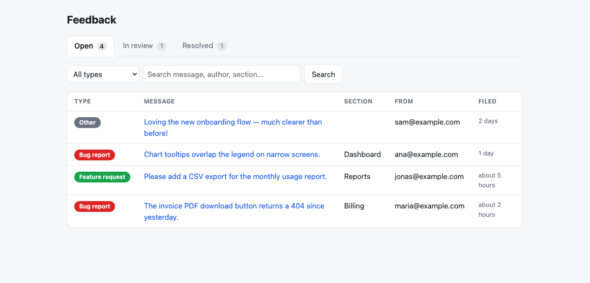

# ideasbugs

[](https://rubygems.org/gems/ideasbugs)
[](https://rubygems.org/gems/ideasbugs)
[](https://github.com/yshmarov/ideasbugs/actions/workflows/ci.yml)
[](MIT-LICENSE)

**In-app product feedback for Rails.** A "Send feedback" widget plus a triage
dashboard — bug reports, feature requests, screenshots — all in your own
database. Self-hosted alternative to Canny.

<table>
<tr>
<td width="36%" valign="top">
<picture>
  <source media="(prefers-color-scheme: dark)" srcset="docs/screenshots/widget-dark.png">
  
</picture>
</td>
<td width="64%" valign="top">
<picture>
  <source media="(prefers-color-scheme: dark)" srcset="docs/screenshots/dashboard-dark.png">
  
</picture>
</td>
</tr>
</table>

## Install

```ruby
# Gemfile
gem "ideasbugs"
```

```bash
bundle install
bin/rails generate ideasbugs:install
bin/rails db:migrate
```

```erb
<%# app/views/layouts/application.html.erb, before </body> %>
<%= ideasbugs_tag %>
```

That's it. A floating **Feedback** button appears bottom-right; submissions
land at `/feedback`.

Optional demo data:

```bash
bin/rails ideasbugs:seed_demo
```

It creates three idempotent sample submissions across the open, in-review, and
resolved states. Running the task again refreshes those records instead of
duplicating them.

> [!IMPORTANT]
> The dashboard defaults to **development only**. Set `authorize_admin` before
> you deploy — see [Configure](#configure).

Ruby >= 3.2 · Rails >= 7.1 · Active Storage only if you want screenshots ·
CSRF token comes from `csrf_meta_tags`, already in a standard Rails layout.

Installing with a coding agent? Point it at [AGENTS.md](AGENTS.md) — the same
steps in the order an agent needs them, plus the gates it tends to get wrong and
the things it should not do. It ships inside the gem, so
`cat "$(bundle show ideasbugs)/AGENTS.md"` works from any app that bundles it.

## What you get

|              |                                                                          |
| ------------ | ------------------------------------------------------------------------ |
| **Widget**   | Type (bug / feature / other), optional section, message, up to 3 screenshots |
| **Dashboard**| Status tabs (open → in review → resolved), type filter, search, inline screenshots |
| **Storage**  | `ideasbugs_feedbacks` — ordinary Active Record rows you can query and export |
| **Deps**     | None. Plain JS — no Tailwind, no Stimulus, no importmap, no build step    |
| **Auth**     | Lambdas over the raw request — Devise, Rails 8 auth, Basic auth, anything |
| **i18n**     | 26 languages, RTL mirrored, English fallback                             |
| **Theme**    | Follows system light/dark. No config                                     |
| **Turbo**    | Works with Turbo Drive out of the box                                    |
| **CSP**      | Carries the request nonce. Works under strict `script-src`               |

## Why not Canny

|                          | `ideasbugs`               | Hosted feedback SaaS   |
| ------------------------ | ------------------------- | ---------------------- |
| Cost                     | Free, MIT                 | Monthly, often per-seat |
| Where feedback lives     | Your database             | The vendor's           |
| Who users log in as      | Already signed in to your app | A second account   |
| Attribution              | Your `current_user`       | Email they type        |
| Querying / exporting     | Plain Active Record       | Their API              |
| Public voting board      | [On the roadmap](https://github.com/yshmarov/ideasbugs/issues/1) | ✅ |

## Configure

Everything is optional — a fresh install works with zero config. In
`config/initializers/ideasbugs.rb`:

| Option                | Default                     | What it does                                        |
| --------------------- | --------------------------- | --------------------------------------------------- |
| `authorize_admin`     | development only            | **Who can read the dashboard.** Override before deploying |
| `base_controller_class` | `ActionController::Base` | Controller the dashboard inherits — name your admin's and it adopts its layout, helpers and auth |
| `admin_layout`        | the gem's own               | Just the shell, if you don't want the whole controller |
| `enabled`             | everyone                    | Who can send feedback. `false` hides the widget and rejects posts |
| `current_user`        | `nil`                       | Attribute a submission to a user. Receives the request |
| `author_label`        | the user's `email`          | Short label stored and shown in the dashboard        |
| `tenant`              | `nil`                       | One board per tenant — see [Multi-tenancy](#multi-tenancy) |
| `kinds`               | `%w[bug feature other]`     | Feedback types. Labels via `ideasbugs.kinds.<kind>`  |
| `sections`            | `[]`                        | App areas shown as a select. Empty hides it          |
| `screenshots`         | `true`                      | Allow uploads (needs Active Storage)                 |
| `max_screenshots`     | `3`                         | Enforced server-side                                 |
| `max_screenshot_size` | `5.megabytes`               | Enforced server-side                                 |
| `storage_service`     | app default                 | Active Storage service for screenshots (`storage.yml` key) |
| `rate_limit`          | `{ to: 10, within: 1.minute }` | Per-IP throttle (Rails 7.2+). `nil` disables      |
| `show_button`         | `true`                      | The floating button. `false` to use your own trigger |
| `button_label`        | `nil`                       | Fixed button text. `nil` uses the localized default  |
| `mount_path`          | `"/feedback"`               | Keep in sync with `mount` in `routes.rb`             |
| `on_submit`           | no-op                       | Runs inline after each save — Slack, email, tickets  |

Gates receive the **raw request**, so they work with any auth:

```ruby
# Devise / Warden
config.current_user    = ->(request) { request.env["warden"]&.user }
config.authorize_admin = ->(request) { request.env["warden"]&.user&.admin? }

# Rails 8 built-in auth (bin/rails generate authentication)
config.current_user = lambda do |request|
  token = request.cookies["session_token"]
  Session.find_signed(token)&.user if token
end

# Anything else based on the request
config.authorize_admin = ->(request) { Flipper.enabled?(:feedback_admin) }
```

<details>
<summary><b>Other ways to protect the dashboard</b></summary>

Wrap the mount in a routing constraint — the lambda still applies on top:

```ruby
authenticate :user, ->(user) { user.admin? } do
  mount Ideasbugs::Engine => "/feedback"
end
```

</details>

<details>
<summary><b>Notifications on new feedback</b></summary>

`on_submit` runs inline after each save — keep it fast or hand off to a job:

```ruby
config.on_submit = ->(feedback) do
  SlackNotifier.post("New #{feedback.kind}: #{feedback.message.truncate(100)}")
end
```

</details>

## Trigger it from your own UI

Prefer a nav item over the floating button? Add `data-ideasbugs-open` to any
element, and optionally set `config.show_button = false`.

Gate the trigger with the same check the widget uses — `ideasbugs_tag` renders
nothing when `enabled` rejects the request, so an unguarded trigger is a dead
button for those users. `ideasbugs.title` ships in every bundled language:

```erb
<% if Ideasbugs.enabled?(request) %>
  <button data-ideasbugs-open><%= t("ideasbugs.title") %></button>
<% end %>
```

<details>
<summary><b>Loading the widget on one page only</b></summary>

`ideasbugs_tag` in the layout puts the widget on every page. If your only
trigger lives on one page, render the tag there instead:

```erb
<%# layouts/application.html.erb %>
<head>
  <%= yield :head %>
</head>

<%# users/show.html.erb — the page with the trigger %>
<% content_for :head, ideasbugs_tag %>
```

Turbo-safe either way: the script installs its document-level listeners once
per session and re-renders on `turbo:load`.

**Trade-off:** a `data-ideasbugs-open` element on a page that never rendered
the tag silently does nothing. If triggers appear on several pages, keep the
tag in the layout.

</details>

## Screenshots

Uploads use Active Storage — run `bin/rails active_storage:install` if you
haven't. Count, size and content type are enforced server-side. If Active
Storage isn't loaded, the upload control doesn't render and uploads are
rejected.

## The data

Submissions are ordinary records:

```ruby
Ideasbugs::Feedback.where(status: "open").newest_first.each do |feedback|
  puts "[#{feedback.kind}] #{feedback.message} — #{feedback.author_label}"
end
```

Each row stores `kind`, `section`, `message`, `status` (`open` / `in_review` /
`resolved`), `page_url`, `user_agent`, an optional `tenant`, and optional
`author_id` / `author_label`. Screenshots are Active Storage attachments
(`feedback.screenshots`).

## Multi-tenancy

Give each customer its own board — its own submissions, its own dashboard —
with one resolver:

```ruby
config.tenant = ->(request) { Current.organization&.to_gid&.to_s }
```

Return an **opaque key**: a GlobalID, an id, a subdomain, a slug. The gem never
takes a foreign key into your models and never needs to know what a Customer
is. It stamps the key on each submission and scopes the dashboard (and
screenshot access) to it. `nil` — the default — is a single global board, so
single-tenant apps need none of this.

Authorization composes: `authorize_admin` says *who* is an admin, `tenant` says
*which* tenant they're in. A customer's admin sees only their own board, and a
cross-tenant id 404s.

<details>
<summary><b>Optional model sugar, and upgrading an existing install</b></summary>

A veneer over the string key, not a new coupling:

```ruby
class Customer < ApplicationRecord
  has_feedback              # keyed by to_gid.to_s (match config.tenant)
end

customer.feedback.open      # a normal Active Record relation
```

Apps that skip the concern still get full multi-tenancy from the resolver
alone. Keying by something other than GlobalID? Pass a matching resolver to
both: `has_feedback(key: ->(c){ c.subdomain })` and the same in
`config.tenant`.

**Upgrading:** the `tenant` column is additive and nullable. Run
`bin/rails generate ideasbugs:tenant && bin/rails db:migrate` (a fresh install
already includes it). Existing rows keep a `nil` tenant — the global board — so
nothing changes until you set `config.tenant`.

</details>

## Localization

Every string resolves through Rails I18n under `ideasbugs.*` and follows the
current `I18n.locale`. 26 languages ship; missing keys fall back to English;
RTL locales render mirrored.

<details>
<summary><b>Bundled languages, and overriding the copy</b></summary>

Arabic, Bengali, Bulgarian, Chinese (Simplified), Croatian, Dutch, English,
French, German, Greek, Hindi, Indonesian, Italian, Japanese, Korean,
Luxembourgish, Polish, Portuguese, Romanian, Russian, Spanish, Thai, Turkish,
Ukrainian, Urdu, Vietnamese.

Define the keys in your own locale files — yours win over the gem's:

```yaml
# config/locales/nl.yml
nl:
  ideasbugs:
    button: "Feedback"
    title: "Feedback versturen"
    kinds:
      bug: "Fout melden"
      feature: "Functie aanvragen"
      other: "Overig"
    # …see config/locales/ideasbugs.en.yml for the full key list
```

Custom kinds get labels the same way (`ideasbugs.kinds.<kind>`), falling back
to `kind.humanize`.

</details>

## Security

- **Both gates run server-side**, on every request. The dashboard denies
  everything outside development until you configure `authorize_admin`.
- **Screenshots stream through the dashboard's own gate** — never public Active
  Storage blob URLs. A screenshot can contain anything the user's screen
  showed, so it's reachable only by someone who passes `authorize_admin`,
  whatever your app's blob settings are.
- **Rate-limited per IP** (10/min by default, Rails 7.2+), so one bot can't
  flood your database with uploads.
- **Uploads validated server-side** — count, size, and images-only content
  type — regardless of what the client claims.
- **CSP nonce carried** from `ActionDispatch`. Runtime config ships as
  `<script type="application/json">` (data, not code), so it needs no nonce and
  survives Turbo visits.
- **No foreign key into your user table.** Attribution is loose fields, so the
  gem never couples to your user model.

## Development

```bash
bin/setup
bundle exec rake test         # unit + integration
bundle exec rake test:system  # browser tests (headless Chrome)
bundle exec rubocop
```

Tests run against a dummy Rails app in `test/dummy`; the widget is covered by
Capybara system tests in a real browser. CI runs Rails 7.1 / 7.2 / 8.0 / 8.1
against Ruby 3.2–3.4 (per-version Gemfiles in `gemfiles/`).

## Also by the same author

- [testimonials](https://github.com/yshmarov/testimonials) — testimonials,
  reviews and NPS for Rails. Its NPS detractor hook feeds straight into this gem.
- [SupeRails](https://superails.com) — Rails screencasts.

## License

MIT. Formerly published as `feedback_engine` — see the
[CHANGELOG](CHANGELOG.md) for rename notes.
